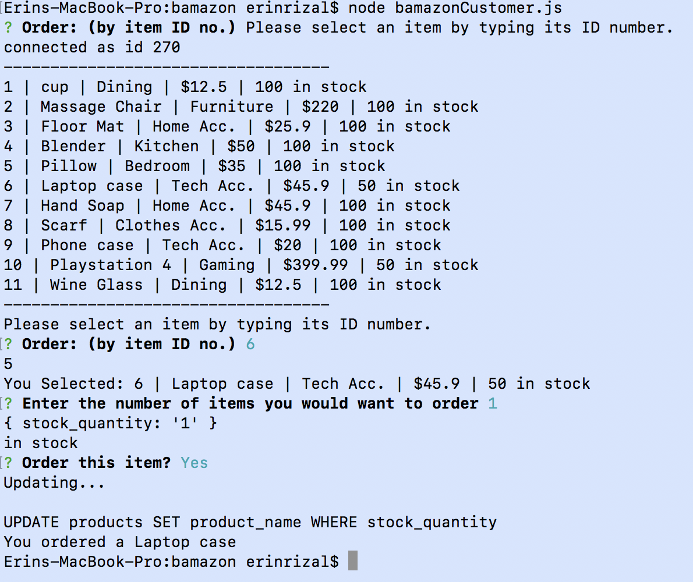

# Bamazon
_____________________________
## description: 

node amazonCustomer.js > prints all items in the table > the user grabs the id of the item > the stock is then checked and if available, updates the quantity > the last message confirms to the user that the order was placed